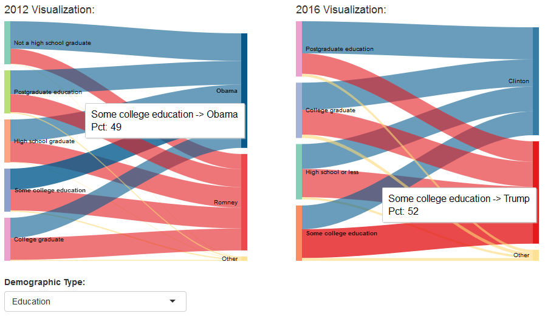
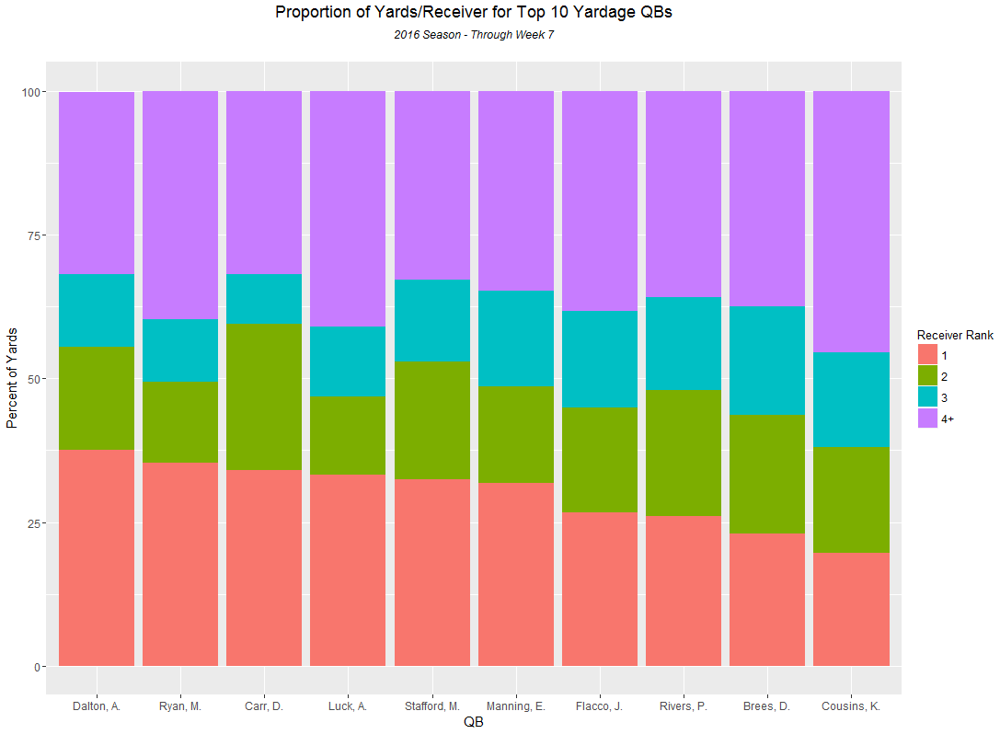
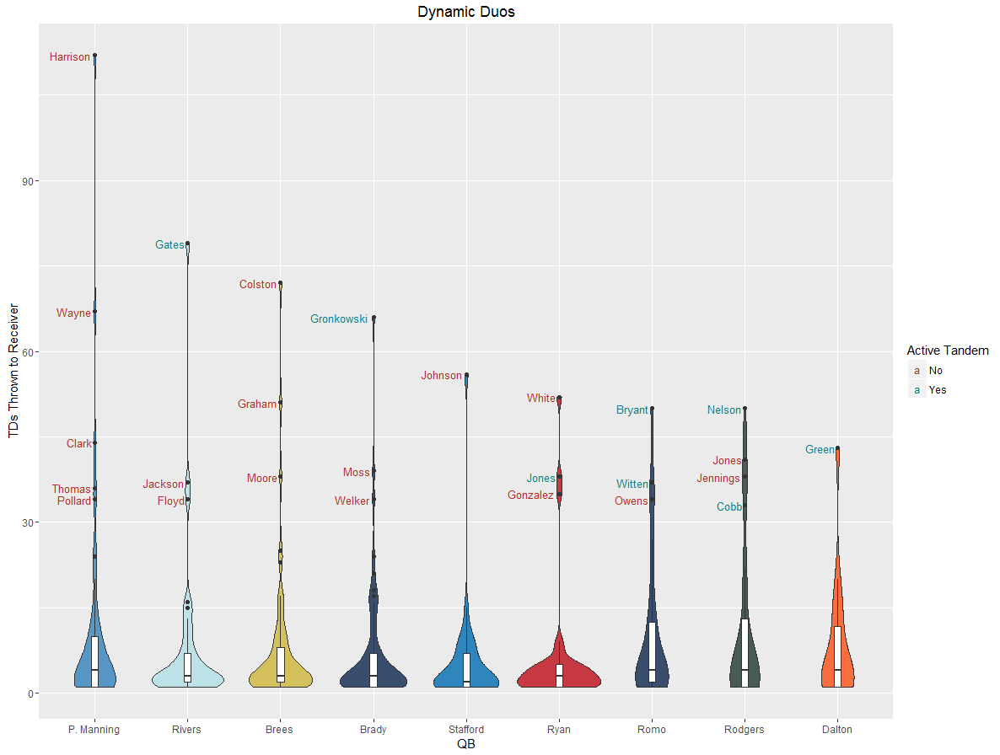
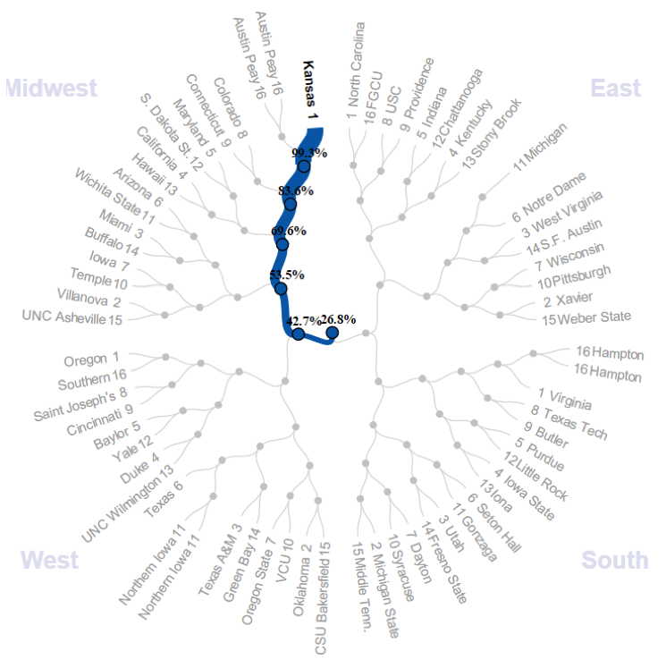

# VizStuff
A Gallery of Miscellaneous Visualizations (but mostly sports stuff)

Data visualizations of anything I can get my hands on.
 - 11/15/16: [Election Demographics of 2016 vs. 2012](https://mtdickey.shinyapps.io/2016_Election/)
   

 - 10/28/16: [NFL QB/Receiver Yardage Distributions (R):](http://rpubs.com/mtdickey/QB-WR-Yardage)
   
   
 - 10/24/16: [NFL QB/Receiver Tandems (R):](https://www.reddit.com/r/dataisbeautiful/comments/597pa1/nfl_top_qbreceiver_tandems_oc/)
   
   
 - 3/16/16: [NCAA Bracket Visualization (d3.js):](https://datacolumn.wordpress.ncsu.edu/blog/2016/03/16/students-take-on-march-machine-learning-mania/)
 
   [Interactive](https://vida.io/documents/Ya5xhppozDH7Bt97W) - Credit to [PowerRank](http://thepowerrank.com/ncaa-tournament-predictions/) for source
   
