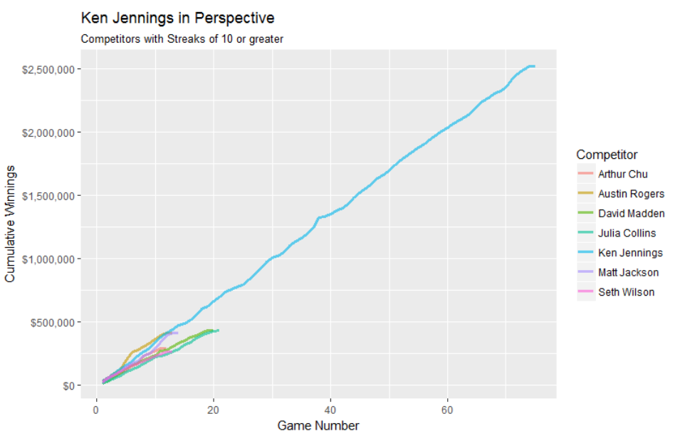

# VizStuff
A Gallery of Miscellaneous Visualizations (but mostly sports stuff)

Data visualizations of anything I can get my hands on.
 - 6/8/19: Jeopardy James vs. Ken Jennings  -- James is king of the big pay days, but falls just short of Ken's all-time earnings record!
   
   
 - 5/7/18: [2018 Potomac River Run Marathon & Half](http://safetyandhealthfoundation.org/20180506.html) -- My first half marathon, finished with a time of 1:37:46.
    
 - 3/14/18: [March Madness 2018](https://github.com/mtdickey/Kaggle-March-Madness/tree/master/2018/Mens)
    
 - 11/13/17: [Top Jeopardy! Competitors](https://thejeopardyfan.com/statistics/ultra-champs-10-game-winners)  -- Austin Rogers off to a better start than Ken Jennings!
   
   But Ken just kept going and going...
   

 - 11/15/16: [Election Demographics of 2012 vs. 2016](https://mtdickey.shinyapps.io/2016_Election/)
   

 - 10/28/16: [NFL QB/Receiver Yardage Distributions (R):](http://rpubs.com/mtdickey/QB-WR-Yardage)
   
   
 - 10/24/16: [NFL QB/Receiver Tandems (R):](https://www.reddit.com/r/dataisbeautiful/comments/597pa1/nfl_top_qbreceiver_tandems_oc/)
   
   
 - 3/16/16: [NCAA Bracket Visualization (d3.js):](https://datacolumn.wordpress.ncsu.edu/blog/2016/03/16/students-take-on-march-machine-learning-mania/)
 
   [Interactive](https://vida.io/documents/Ya5xhppozDH7Bt97W) - Credit to [PowerRank](http://thepowerrank.com/ncaa-tournament-predictions/) for source
   

- 8/20/15: [NBA Shot Chart (Python)](https://twitter.com/mtdickey/status/634557569047089152) - Credit to [Savvas Tjortjoglou](http://savvastjortjoglou.com/nba-shot-sharts.html) for source

  
